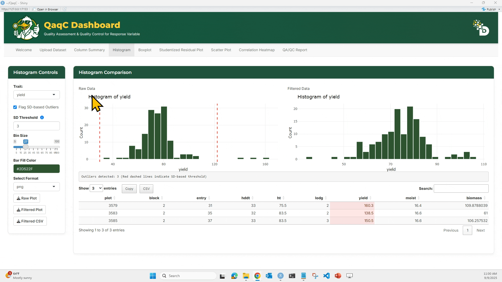
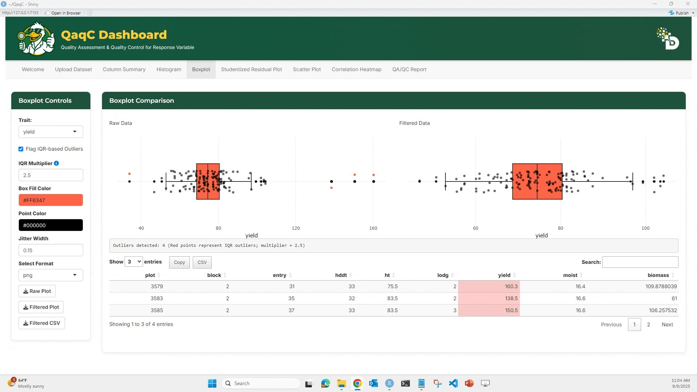
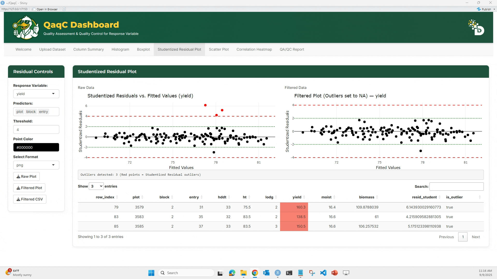

* * * 
* * * 
### Welcome to the **QaqC Dashboard** - your one-stop tool for validating, cleaning, and exploring phenotypic datasets before statistical analysis. This tutorial will walk you through each step of the app with detailed instructions and visual guides.
* * * 
* * * 

## ----------------------------------- Step 1: Upload the Dataset ---------------------------------
---

This is where everything starts. You’ll load your phenotypic CSV file into the app, preview the data, and check for basic issues like missing values or duplicates.

**📥 Purpose:**
   * This is where everything starts. You’ll load your phenotypic CSV file into the app, preview the data, and check for basic issues like missing values or duplicates.

**🎯 What You Can Do:**

 * Upload your `.csv` file.
 * View a Raw Data Preview table.
 * Detect and remove missing values.
 * Detect and remove duplicate rows based on selected columns.

**🖱️ How to Use:** 

---

   **1.** Click “Browse…” to upload your `.csv` file. Make sure the file has column headers in the first row.
            
---
   **2.** After loading, the dataset preview appears on the right side under Raw Data Preview.

  
 ---
      
   **3.** Click “Find Missing Values” to highlight any missing entries (NA or blank).

  
---
      
   **4.** To check for duplicates: Select which column(s) to check, Click “Find Duplicates”, and You can then choose to Remove Duplicates if needed.

  
---

   **5.** Reset Data will clear your current session and allow re-upload.

  
---

**🧠 Tip:**

   * All downstream analyses (summary stats, visualizations, model residuals) use the cleaned dataset, so this step is critical for ensuring high-quality input.

* * * 
* * *
* * * 
* * *

## ----------------------------------- Step 2: Column Summary Tab -----------------------------------
---
---

**🔍 Purpose:** 
Get descriptive statistics for any numeric column — a fast way to assess data spread, potential outliers, and normality.

**🎯 What You Can Do:** 
  * Select any numeric trait from the dropdown.
  * View detailed statistics:
      * Missing count
      * Zero count
      * Min, Max
      * Quartiles (Q1, Median, Q3)
      * Mean, SD, CV%
      * Skewness & Kurtosis

**🖱️ How to Use:**

  1. Choose a trait/column from the “Select Column to Summarize” dropdown.
  2. The Summary Statistics table will update instantly.
  3. Click “Show Definitions” to view explanations of each metric.

**📘 Metric Definitions (examples):**

  * CV (%): Coefficient of Variation. Helps compare variation across traits with different units.
  * Skewness: Indicates asymmetry of the distribution.
  * Kurtosis: Measures tail heaviness. >0 = heavier tails.

   
      

* * * 
* * *
* * * 
* * *

## -------------------------------- 🚦 Step 3: Visualize & Detect Outliers --------------------------------

This step includes three tabs — Histogram, Boxplot, and Studentized Residual Plot — that help detect and visualize unusual patterns or outlier values.
* * *

## 📉 Tab 1: Histogram

**🎯 What You Can Do:**

  * Visualize frequency distribution of a numeric trait.
  * Adjust bin size and color.
  * Flag outliers using Standard Deviation thresholds.
  * Download plots or filtered data.

**🖱️ How to Use:**

  1. Select a trait.
  2. Optionally enable "Flag SD-based Outliers" and set bin size (if needed).
  3. Compare Raw vs Filtered histograms.
      * Filtered histogram excludes flagged outliers.
  4. Below the plots, see a summary table of outlier rows.
  5. Use the download buttons to save:
      * Raw Plot, Filtered Plot, or Filtered CSV.

   

---

## 📦 Tab 2: Boxplot

**🎯 What You Can Do:**

  * Identify outliers using IQR-based method.
  * Customize box fill and point color.
  * Adjust jitter for dot spacing.

**🖱️ How to Use:**

  1. Select a trait.
  2. Optionally enable "Flag IQR-based Outliers".
  3. Compare Raw vs Filtered boxplots.
  4. Below the plots, see a summary table of outlier rows.
  5. Customize plot aesthetics if desired.
  6. Download plots and cleaned data.

   

---

## 📈 Tab 3: Studentized Residual Plot

**🎯 What You Can Do:**

  * Detect outliers using a linear model.
  * Plot studentized residuals against fitted values.
  * Flag residuals exceeding ±4 threshold.
  * View and export a table of detected outliers.

**🖱️ How to Use:**

  1. Choose a Response Variable (e.g., yield).
  2. Select Predictors (e.g., plot, block, entry).
  3. Set a threshold (default = 4).
  4. View the Raw vs Filtered studentized residual plots.
       * Red dots = outliers
  5. Below the plots, see a summary table of outlier rows.
  6. Export plot or cleaned dataset.

   

* * * 
* * *
* * *
* * *

## -------------------------------- Step 4: Pairwise & Overall Relationships --------------------------------

#### Once individual traits are cleaned, the next step is to explore relationships between traits. This is crucial for detecting hidden correlations, multicollinearity, or unexpected trends.

* * *

#### We use two tabs here: Scatter Plot (pairwise) and Correlation Heatmap (overall).

**🔹 Tab 1: Scatter Plot**

**🎯 What You Can Do:**

  * Plot a response variable against a predictor variable.
  * Add a linear regression line or correlation ellipse.
  * Flag and filter outliers if needed.
  * Display model statistics below the plot:
      * Equation of best-fit line
      * _R²_ (coefficient of determination)
      * _p_-value (significance of relationship)
      * Pearson’s correlation (strength & direction of association)

**🖱️ How to Use:**

  1. From the left panel, select a Response Variable (e.g., yield).
  2. Select a Predictor Variable (e.g., plot).
  3. (Optional) Check “Add Linear Model” to overlay a regression line.
  4. (Optional) Add a Correlation Ellipse to visualize spread.
  5. Compare Raw vs Filtered scatterplots.
  6. Review model results under each plot.

**📘 Interpretation Example:**

 * If _R²_ = 0.01 → very weak relationship.
 * If Pearson’s _r_ = 0.75 → strong positive correlation.
 * _p_-value < 0.05 → relationship is statistically significant.

   

* * * 
* * *

