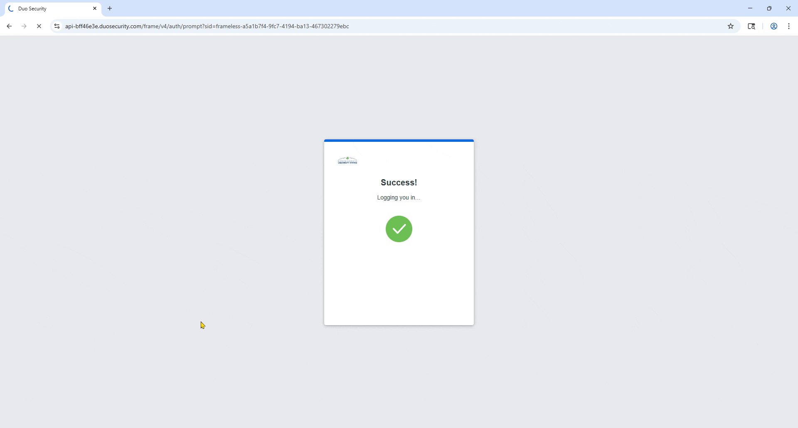
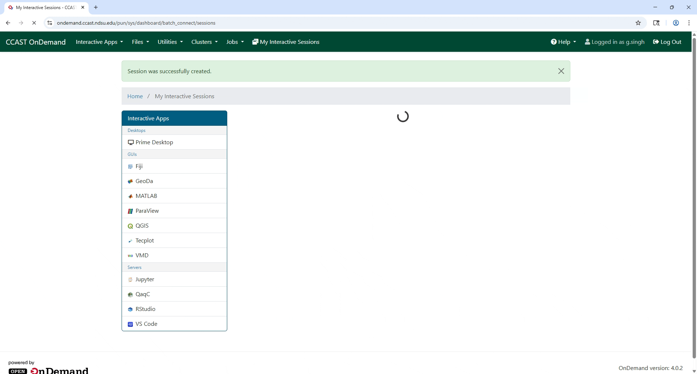
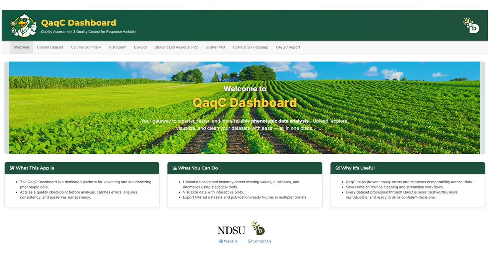
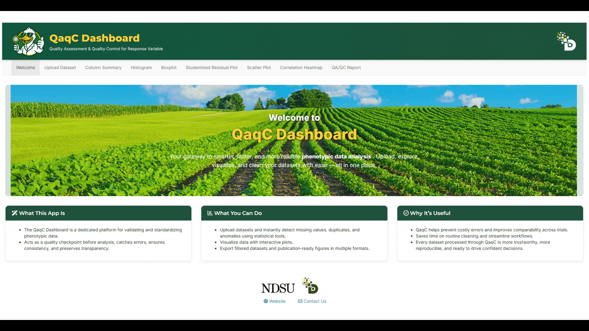

* * * 
* * * 
Welcome to the **QaqC Dashboard** - your one-stop tool for validating, cleaning, and exploring phenotypic datasets before statistical analysis. This tutorial will walk you through each step of the app with detailed instructions and visual guides.
* * * 
* * * 

## ----------------------------- Step 1: Upload the Dataset ---------------------------
---

This is where everything starts. You’ll load your phenotypic CSV file into the app, preview the data, and check for basic issues like missing values or duplicates.

**📥 Purpose:**
   * This is where everything starts. You’ll load your phenotypic CSV file into the app, preview the data, and check for basic issues like missing values or duplicates.

**🎯 What You Can Do:**

 * Upload your `.csv` file.
 * View a Raw Data Preview table.
 * Detect and remove missing values.
 * Detect and remove duplicate rows based on selected columns.

**🖱️ How to Use:**

   1. Click “Browse…” to upload your .csv file.
         * Make sure the file has column headers in the first row.
   2. After loading, the dataset preview appears on the right side under Raw Data Preview.

         
      
   4. Click “Find Missing Values” to highlight any missing entries (NA or blank).

         
      
   6. To check for duplicates:
         * Select which column(s) to check.
         * Click “Find Duplicates”.
         * You can then choose to Remove Duplicates if needed.

         

   8. Reset Data will clear your current session and allow re-upload.

         

**🧠 Tip:**

   * All downstream analyses (summary stats, visualizations, model residuals) use the cleaned dataset, so this step is critical for ensuring high-quality input.

* * * 

**#2. Click on “QaqC App” under Interactive Apps**

   On the top menu, click **Interactive Apps**, then select **QaqC App** from the dropdown or scroll down and find QaqC in the application grid.

   It will open a new window. **Click “Launch”**
   

   

* * *

**#3. Click "Connect to QaqC"**

   After a few seconds, a new “session” will appear below. Click **Connect to QaqC**.  

   
   

* * *

**#4. App opens in your browser** 🎉

   You’re now ready to use the QaqC Dashboard!

* * * 
* * *
* * * 
* * *

## --------------------------- Step 2: Overview of the QaqC Dashboard ---------------------------
---
---

 * When we launch the app, we will see this `Welcome`/landing page. We can read and familirize ourself with app, what it is and what we can achieve with it.

   
      
---

 * The `Upload Dataset` tab will help us upload our dataset (.csv). By default, the QaqC dashboard loads a sample dataset.

   
      
---

