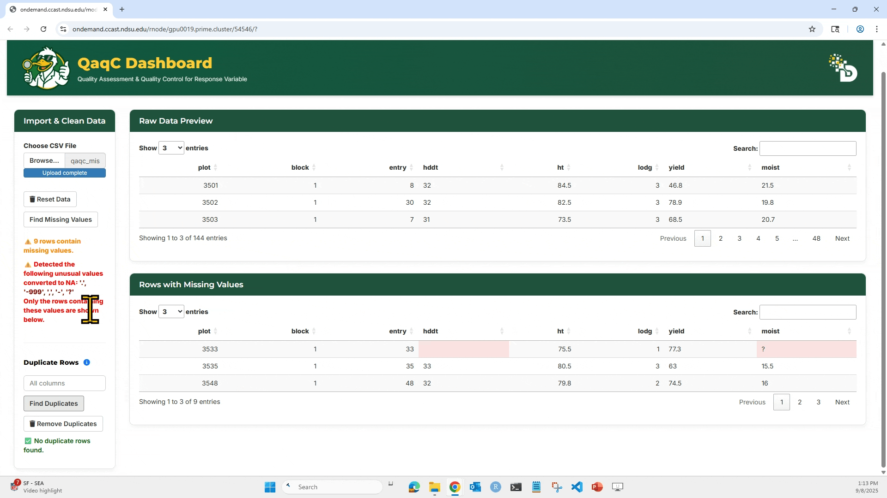
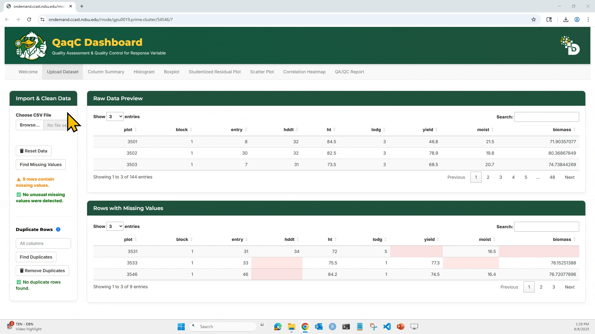

* * * 
* * * 
Welcome to the **QaqC Dashboard** - your one-stop tool for validating, cleaning, and exploring phenotypic datasets before statistical analysis. This tutorial will walk you through each step of the app with detailed instructions and visual guides.
* * * 
* * * 

## ----------------------------------- Step 1: Upload the Dataset ---------------------------------
---

This is where everything starts. You’ll load your phenotypic CSV file into the app, preview the data, and check for basic issues like missing values or duplicates.

**📥 Purpose:**
   * This is where everything starts. You’ll load your phenotypic CSV file into the app, preview the data, and check for basic issues like missing values or duplicates.

**🎯 What You Can Do:**

 * Upload your `.csv` file.
 * View a Raw Data Preview table.
 * Detect and remove missing values.
 * Detect and remove duplicate rows based on selected columns.

**🖱️ How to Use:** 

---

   **1.** Click “Browse…” to upload your `.csv` file. Make sure the file has column headers in the first row.
            
---
   **2.** After loading, the dataset preview appears on the right side under Raw Data Preview.

  
 ---
      
   **3.** Click “Find Missing Values” to highlight any missing entries (NA or blank).

  
---
      
   **4.** To check for duplicates: Select which column(s) to check, Click “Find Duplicates”, and You can then choose to Remove Duplicates if needed.

  
---

   **5.** Reset Data will clear your current session and allow re-upload.

  
---

**🧠 Tip:**

   * All downstream analyses (summary stats, visualizations, model residuals) use the cleaned dataset, so this step is critical for ensuring high-quality input.

* * * 
* * *
* * * 
* * *

## ------------------------------------ Step 2: Column Summary Tab ------------------------------------
---
---

**🔍 Purpose: Get descriptive statistics for any numeric column — a fast way to assess data spread, potential outliers, and normality.**

**🎯 What You Can Do:** 
    * Select any numeric trait from the dropdown.
    * View detailed statistics:
        * Missing count
        * Zero count
        * Min, Max
        * Quartiles (Q1, Median, Q3)
        * Mean, SD, CV%
        * Skewness & Kurtosis

**🖱️ How to Use:**

  1. Choose a trait/column from the “Select Column to Summarize” dropdown.
  2. The Summary Statistics table will update instantly.
  3. Click “Show Definitions” to view explanations of each metric.

**📘 Metric Definitions (examples):**

  * CV (%): Coefficient of Variation. Helps compare variation across traits with different units.
  * Skewness: Indicates asymmetry of the distribution.
  * Kurtosis: Measures tail heaviness. >0 = heavier tails.

   
      
---

 * The `Upload Dataset` tab will help us upload our dataset (.csv). By default, the QaqC dashboard loads a sample dataset.

---

