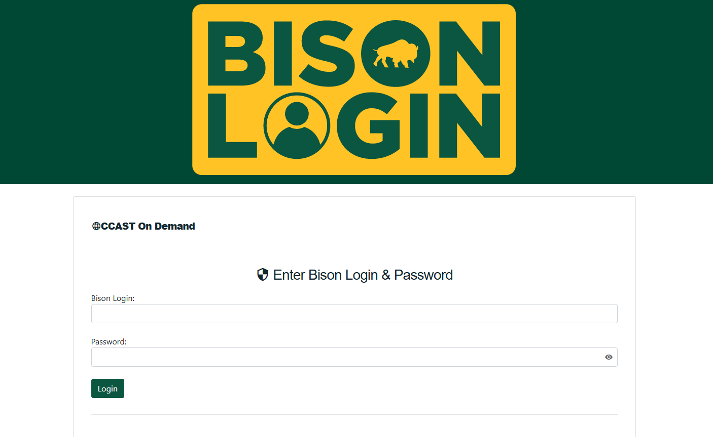

## Step 1: Launch the QaqC Dashboard on CCAST

Once your account is approved and you can log in, launching the QA/QC app takes just a few clicks.

1. **Log in to the OnDemand Portal**  
   Go to:  
   <a href="https://ondemand.ccast.ndsu.edu" target="_blank">https://ondemand.ccast.ndsu.edu</a>  
   Use your Bison Login email and password.  
   

* * * 

2. **Click on “QaqC App” under Interactive Apps**  
   On the top menu, click **Interactive Apps**, then select **QaqC App** from the dropdown or grid.  
   

3. **Fill in the job form**  
   - **Cluster**: Thunder Prime (or as instructed)  
   - **Cores**: 2–4 is usually enough  
   - **Time**: e.g., `01:00:00` (1 hour)  
   - **Account / Project**: Choose your `x-ccast-prj-…` group  
   - (Other settings can be left as default)  
   

4. **Click “Launch”**  
   After a few seconds, a new “session” will appear below. Click **Connect to QaqC App**.  
   

5. **App opens in your browser** 🎉  
   You’re now ready to use the QA/QC Dashboard! The interface will walk you through selecting your dataset and running data validation steps.  
   

