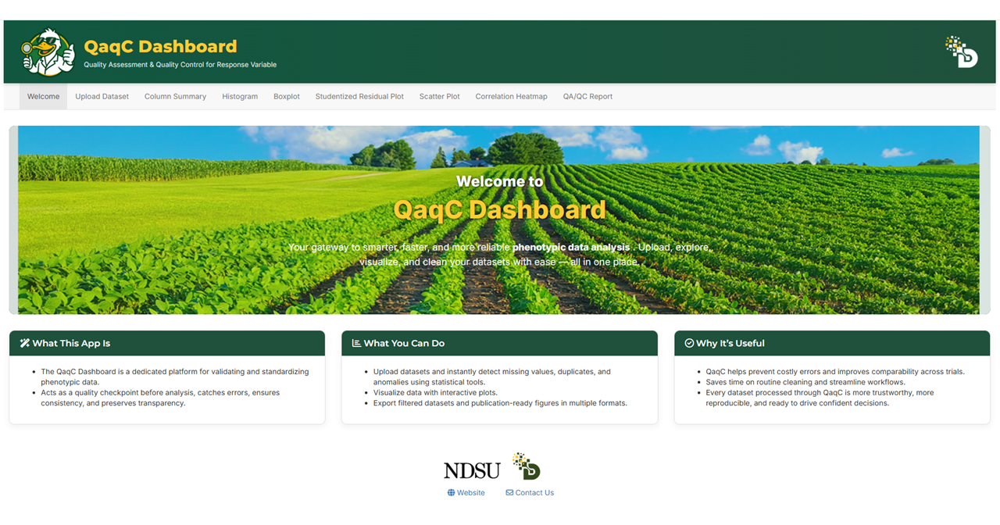
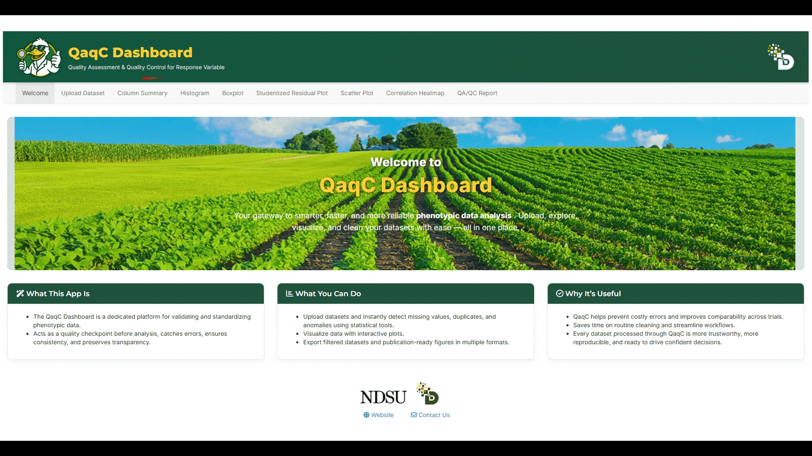
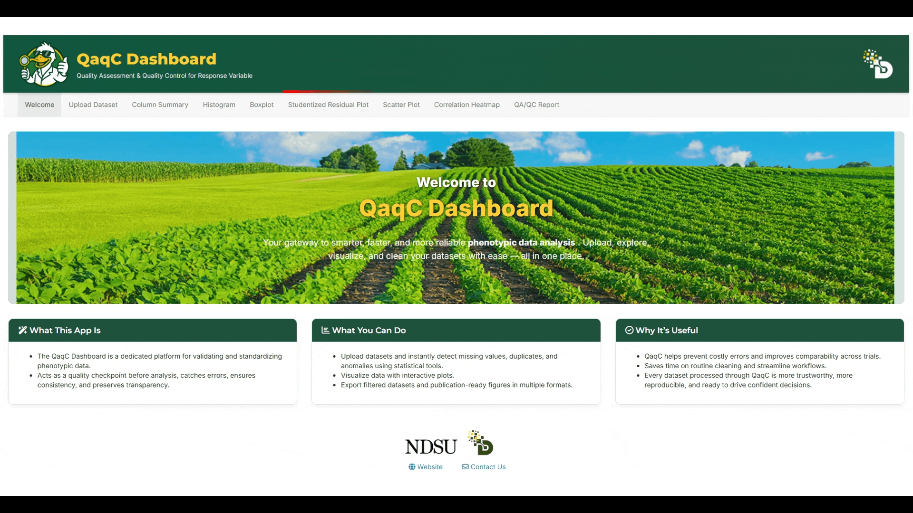

* * * 
* * * 

## Step 1: Launch the QaqC Dashboard on CCAST

Once your account is approved and you can log in, launching the QaqC app takes just a few clicks.

**#1. Log in to the NDSU CCAST OnDemand Portal**

   Go to: <a href="https://ondemand.ccast.ndsu.edu" target="_blank">https://ondemand.ccast.ndsu.edu</a>
   
   Use your Bison Login email and password.

   
   

* * * 

**#2. Click on “QaqC App” under Interactive Apps**

   On the top menu, click **Interactive Apps**, then select **QaqC App** from the dropdown or scroll down and find QaqC in the application grid.

   It will open a new window. **Click “Launch”**
   

   

* * *

**#3. Click "Connect to QaqC"**

   After a few seconds, a new “session” will appear below. Click **Connect to QaqC**.  

   
   

* * *

**#4. App opens in your browser** 🎉

   You’re now ready to use the QaqC Dashboard!

* * * 
* * *
* * * 
* * *

## Step 2: Overview of the QaqC Dashboard

   
      

   
      

   

   

   

   

      
