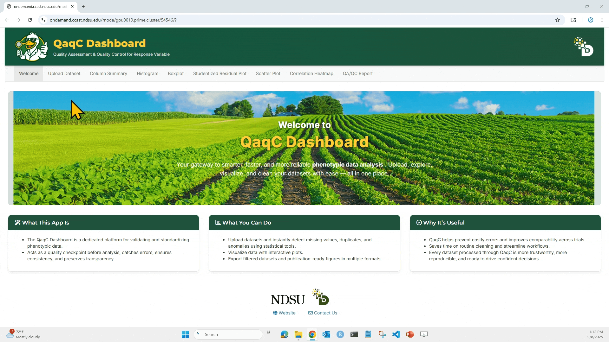

* * * 
* * * 

## -------------------------- Step 1: Upload the Dataset ------------------------
---

The very first step is to upload the dataset in `.csv` format and clean it for missing values and duplicate rows.

**#1. Upload the dataset**

  Click on `Browse` option, then it will show us the `.csv` files in the particular directory and we can choose the file on which we wanted to QA/QC parameters.

   

* * * 

**#2. Click on “QaqC App” under Interactive Apps**

   On the top menu, click **Interactive Apps**, then select **QaqC App** from the dropdown or scroll down and find QaqC in the application grid.

   It will open a new window. **Click “Launch”**
   

   

* * *

**#3. Click "Connect to QaqC"**

   After a few seconds, a new “session” will appear below. Click **Connect to QaqC**.  

   
   

* * *

**#4. App opens in your browser** 🎉

   You’re now ready to use the QaqC Dashboard!

* * * 
* * *
* * * 
* * *

## --------------------------- Step 2: Overview of the QaqC Dashboard ---------------------------
---
---

 * When we launch the app, we will see this `Welcome`/landing page. We can read and familirize ourself with app, what it is and what we can achieve with it.

   
      
---

 * The `Upload Dataset` tab will help us upload our dataset (.csv). By default, the QaqC dashboard loads a sample dataset.

   
      
---

